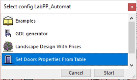
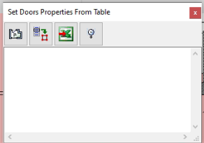
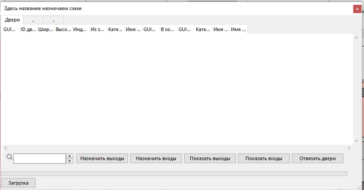
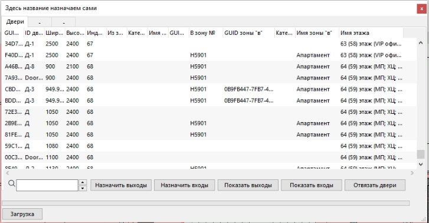
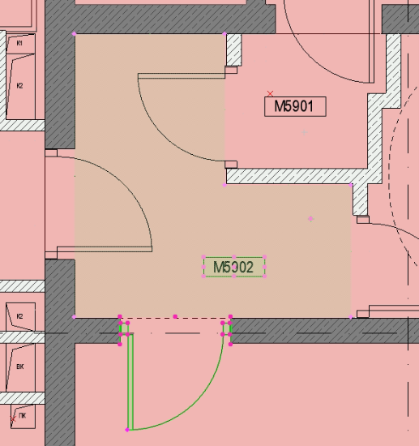
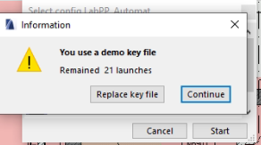

# labppSetDoorsPropertiesFromTable    

## Установка    

1. установить себе `LabPP` `https://www.labpp.ru/labpp-automat-ru`;    
  1.1. зарегаться на github.com;    
  1.2. дать свой никнейм Ивану @kenchiku;    
  1.3. он вас пригласит;    
  1.4. принять приглашение;    
  1.5. забрать скрипт последней версии с `https://github.com/dduucckk/labppSetDoorsPropertiesFromTable`;    
  1.6. скопировать его в папку с установленным LabPP где находятся другие скрипты `C:\Program Files\GRAPHISOFT\ARCHICAD 23\Add-Ons\LabPP_AutomatAC23RUS\tsprglist`;    
2. активировать лицензию на LabPP, следуя инструкциям самого `LabPP` `https://www.labpp.ru/labppregru`;    
3. поставить майкрософт офис;    
4. и когда будет всё готово у Ивана, каждую дверь этим скриптом привязать к одной-двум зонам;    
5. Как быть с модульными этажами я не понимаю, надеюсь что не нужно будет открывать каждый модуль;    
  6.1. Опционально - поставить себе git на компьютер;    
  6.2. Открыть командную строку `CMD`;    
  6.3. Перейти в папку адона командами `c:`  `cd C:\Program Files\GRAPHISOFT\ARCHICAD 23\Add-Ons\LabPP_AutomatAC23RUS\tsprglist`;    
  6.2. Командой `git clone git@github.com:dduucckk/labppSetDoorsPropertiesFromTable.git ./` клонировать в текущую папку;    
  6.3. Командой `cp "labppSetDoorsPropertiesFromTable/Set Doors Properties From Table" ../` копировать содержимое на место;    

## Использование    

1.    Открываем `Design-Extras-LabPP`    
    
2.    Открываем set doors properties from file    
    
3.    Нажимаем первую функцию - назначение зон для двери. Каждой двери даём две зоны - входную и выходную. Выделяя на плане (смотри 6 пункт) зону и дверь, нажимаем либо `назначить входную зону` либо `выходную`. Вход всегда осуществляем из лифтового холла, и по направлению от него например жилой коридор это вход, квартира это выход. Лифтовый холл это вход, лестничная клетка - выход.    
    
5.    Чтобы посмотреть результат, выделяем двери и нажимаем `Загрузка`, появится список дверей, у которых будет объявлена входная зона и выходная    
    
7.    На плане следует выбрать дверь (должна быть редактируемая) и зону. В данном случае, тамбур и выход на улицу, на кровлю. На кровле не всегда есть зона, потому выходная зона будет пустой в данном случае    
    

## Проблемы    

    
