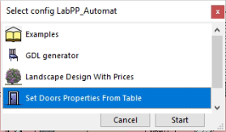
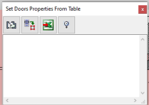
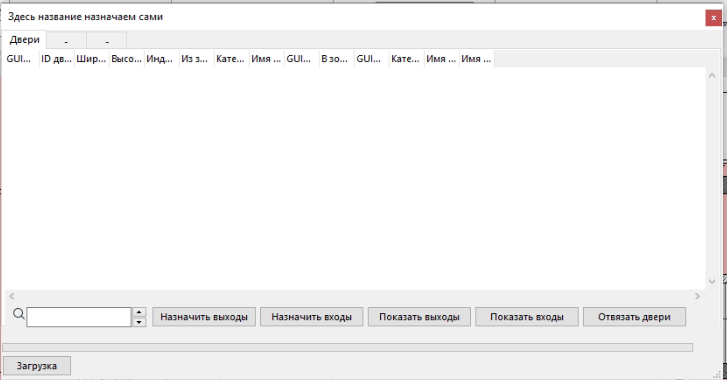
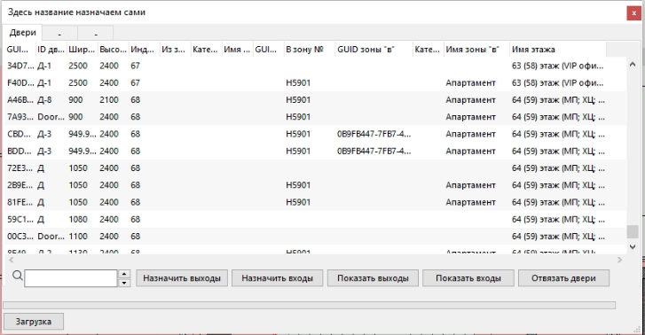
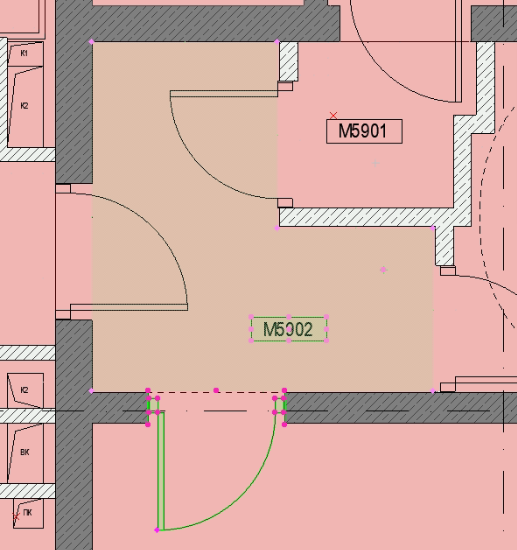
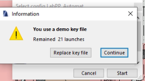

# labppSetDoorsPropertiesFromTable    

## Установка    

1. Установить себе [`LabPP`](https://www.labpp.ru/labpp-automat-ru);    
2. Активировать лицензию на LabPP, следуя инструкциям самого [`LabPP`](https://www.labpp.ru/labppregru);    
3. Поставить майкрософт офис;    
4. Взять актуальный скрипт `labppSetDoorsPropertiesFromTable` руководствуясь следующим пунктом доступ к адону;    

### Доступ к адону    

1. Зарегаться на github.com;    
2. Дать свой никнейм с гитхаба Ивану [@kenchiku](@kenchiku) aka [@dduucckk](@dduucckk);    
3. Он вас пригласит;    
4. Принять приглашение;    
5. Забрать скрипт последней версии с [дверодела](https://github.com/dduucckk/labppSetDoorsPropertiesFromTable);    
6. Скопировать его в папку с установленным `LabPP` где находятся другие скрипты `C:\Program Files\GRAPHISOFT\ARCHICAD 23\Add-Ons\LabPP_AutomatAC23RUS\tsprglist`;    

## Работа через командную строку с git    

1. Поставить себе `git` на компьютер и настроить `git config --global user.name "%USERNAME%"`;    
2. Открыть командную строку `CMD`;    
3. Перейти в папку адона командами `c:`  `cd C:\Program Files\GRAPHISOFT\ARCHICAD 23\Add-Ons\LabPP_AutomatAC23RUS\tsprglist`;    
4. Командой `git clone git@github.com:dduucckk/labppSetDoorsPropertiesFromTable.git ./labppSetDoorsPropertiesFromTable` клонировать в текущую папку;    
5. Командой `cp "labppSetDoorsPropertiesFromTable/Set Doors Properties From Table" ../` копировать содержимое на место;    
6. Для простого обновления репы удалить привязку к оригиналу `git remote remove origin`;    
7. Создать токен как написано тут: [токенодел](https://docs.github.com/en/authentication/keeping-your-account-and-data-secure/creating-a-personal-access-token) скопировать его;     
8. Вставить заместо слова токен свой токен и привязать репу к оригиналу `git remote add origin https://[ТОКЕН]@github.com:dduucckk/labppSetDoorsPropertiesFromTable`;    
9. В дальнейшем чтобы не ходить на сайт можно пользоваться такой строкой из папки с репой (`labppSetDoorsPropertiesFromTable`) `git pull`;    
10. При внесении изменений `git pull` `git add .` `git commit -am ''` `git push`

## Использование    

1.    Открываем `Design-Extras-LabPP`    
    
2.    Открываем set doors properties from file    
    
3.    Нажимаем первую функцию - назначение зон для двери. Каждой двери даём две зоны - входную и выходную. Выделяя на плане (смотри 6 пункт) зону и дверь, нажимаем либо `назначить входную зону` либо `выходную`. Вход всегда осуществляем из лифтового холла, и по направлению от него например жилой коридор это вход, квартира это выход. Лифтовый холл это вход, лестничная клетка - выход.    
    
5.    Чтобы посмотреть результат, выделяем двери и нажимаем `Загрузка`, появится список дверей, у которых будет объявлена входная зона и выходная    
    
7.    На плане следует выбрать дверь (должна быть редактируемая) и зону. В данном случае, тамбур и выход на улицу, на кровлю. На кровле не всегда есть зона, потому выходная зона будет пустой в данном случае    
    

## Проблемы    

    
